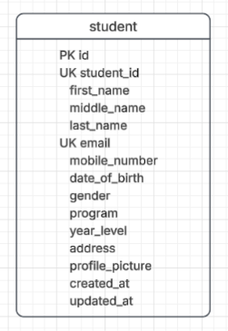
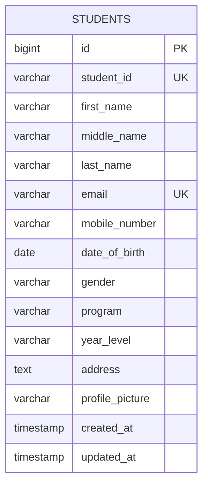
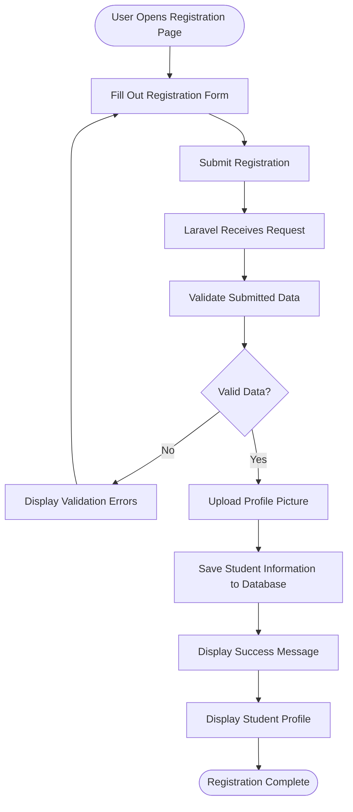

# Student Registration System

A Laravel-based web application for registering and managing student information digitally.

---

## 1. Project Title

**Student Registration System**

---

## 2. Introduction

### Purpose of a Student Registration System

The Student Registration System is a web-based application designed to digitize the student registration process. It allows users to submit student information such as Student ID, name, email address, mobile number, date of birth, gender, program, year level, address, and profile picture through an online registration form.

The system reduces the need for paper-based registration and provides a more organized way of storing and viewing student information.

### Importance of Data Validation

Data validation ensures that the information submitted by users is complete, accurate, and follows the required format before it is stored in the database.

In this system, Laravel validation is used to check required fields, ensure that Student IDs and email addresses are unique, validate email formats, accept numeric mobile numbers, and verify that uploaded profile pictures are valid image files.

Validation helps prevent incorrect or incomplete data from entering the database and provides users with clear error messages when their input needs to be corrected.

### Role of Registration Systems in Enterprise Applications

Registration systems play an important role in enterprise applications because they provide a structured method for collecting and managing user information.

In larger organizations, registration systems can be connected to databases, authentication systems, reporting tools, administrative dashboards, and other business applications. They help reduce manual processes, improve data organization, and make information easier to retrieve and manage.

This project demonstrates fundamental enterprise application concepts such as form processing, server-side validation, database operations, file uploading, and user feedback using the Laravel framework.

## 3. Objectives

The objectives of this activity are:

* To develop a functional Student Registration System using Laravel.
* To understand how Laravel handles form submissions using Blade templates.
* To implement server-side validation for student registration data.
* To use Laravel migrations to create and manage the `students` database table.
* To understand how Laravel models interact with the database.
* To implement profile picture uploading using Laravel Storage.
* To display validation errors and success notifications to users.
* To display registered student information after successful registration.
* To understand the Laravel request lifecycle from the browser to the database and back to the user.
* To practice organizing a web application using the Model-View-Controller (MVC) architecture.

---

## 4. Laravel Request Lifecycle

The Laravel request lifecycle describes how a user's request travels through different parts of the Laravel application before a response is returned.

In the Student Registration System, the registration process follows this general flow:

```text
┌──────────────────┐
│     Browser      │
│ Student submits  │
│ registration form│
└────────┬─────────┘
         │
         ▼
┌──────────────────┐
│      Route       │
│   POST /register │
└────────┬─────────┘
         │
         ▼
┌──────────────────────┐
│      Controller      │
│  StudentController   │
│       store()        │
└──────────┬───────────┘
           │
           ▼
┌──────────────────────┐
│      Validation      │
│ Check required fields│
│ unique, email, image │
└──────────┬───────────┘
           │
           ▼
┌──────────────────────┐
│        Model         │
│   Student::create()  │
└──────────┬───────────┘
           │
           ▼
┌──────────────────────┐
│       Database       │
│    students table    │
└──────────┬───────────┘
           │
           ▼
┌──────────────────────┐
│       Response       │
│ Success page showing │
│ registered student   │
└──────────────────────┘
```

### Step-by-Step Request Flow

**1. Browser**

The process starts when the user fills out the registration form and clicks the **Register Student** button. The browser sends the form data to the Laravel application using an HTTP POST request.

**2. Route**

The request is received by the registration route defined in `routes/web.php`.

```php
Route::post('/register', [StudentController::class, 'store'])
    ->name('students.store');
```

The route directs the request to the `store()` method of `StudentController`.

**3. Controller**

The `StudentController` receives and processes the submitted information. The controller is responsible for validating the data, handling the profile picture upload, creating the student record, and returning the appropriate response.

**4. Validation**

Laravel checks the submitted information against the defined validation rules. If the information is invalid, Laravel redirects the user back to the form and provides validation error messages.

If the information is valid, the registration process continues.

**5. Model**

The `Student` model represents the `students` database table. After validation, the model is used to create a new student record.

```php
Student::create($validated);
```

**6. Database**

The validated student information is stored in the `students` table. The profile picture path is also stored in the database while the actual image file is stored using Laravel's public storage disk.

**7. Response**

After successful registration, Laravel returns a response that displays the registered student's information. The system also displays a success notification.

---

## 5. Validation Rules

Validation ensures that the information submitted by users is complete, accurate, and follows the requirements of the system. The Student Registration System uses Laravel's server-side validation before saving information to the database.

### Required Fields

The `required` rule ensures that important fields cannot be left empty.

Example:

```php
'student_id' => 'required',
'first_name' => 'required',
'last_name' => 'required',
'email' => 'required',
'mobile_number' => 'required',
'date_of_birth' => 'required',
'gender' => 'required',
'program' => 'required',
'year_level' => 'required',
'address' => 'required',
'profile_picture' => 'required',
```

**Why it is important:**

Required validation prevents incomplete student records from being submitted and stored in the database.

---

### Unique Constraints

The `unique` rule ensures that values such as Student ID and email address are not already registered.

Example:

```php
'student_id' => 'required|unique:students,student_id',
'email' => 'required|email|unique:students,email',
```

**Why it is important:**

Student IDs and email addresses should identify a specific student. Preventing duplicates helps maintain accurate and consistent records.

---

### Email Validation

The `email` rule checks whether the submitted value follows a valid email address format.

Example:

```php
'email' => 'required|email|unique:students,email',
```

**Why it is important:**

It prevents incorrectly formatted email addresses from being stored in the database.

---

### Numeric Validation

The `numeric` rule ensures that the mobile number contains numeric values.

Example:

```php
'mobile_number' => 'required|numeric',
```

**Why it is important:**

This helps ensure that the mobile number field contains an appropriate numeric value instead of letters or other invalid characters.

---

### Image Validation

The `image` rule ensures that the uploaded profile picture is recognized as an image.

The system also restricts the accepted file formats:

```php
'profile_picture' => 'required|image|mimes:jpg,jpeg,png|max:2048',
```

The rules used are:

| Rule                 | Purpose                                |
| -------------------- | -------------------------------------- |
| `required`           | Ensures a profile picture is provided  |
| `image`              | Ensures the uploaded file is an image  |
| `mimes:jpg,jpeg,png` | Limits the accepted image formats      |
| `max:2048`           | Limits the file size to 2048 KB (2 MB) |

**Why it is important:**

Image validation prevents unsupported or inappropriate file types from being uploaded and stored by the application.

---

### File Size Restrictions

The `max:2048` rule limits the uploaded profile picture to **2 MB**.

```php
'profile_picture' => 'required|image|mimes:jpg,jpeg,png|max:2048',
```

**Why it is important:**

File size restrictions help control storage usage and prevent unnecessarily large uploads from affecting application performance.

---

### Summary of Validation

The validation process helps the Student Registration System maintain reliable data by ensuring that:

* Required information is provided.
* Student IDs are unique.
* Email addresses are valid and unique.
* Mobile numbers contain numeric values.
* Profile pictures are valid image files.
* Only JPG, JPEG, and PNG images are accepted.
* Uploaded profile pictures do not exceed 2 MB.

These validation rules provide both **data integrity** and a better user experience by giving users clear feedback when their submitted information does not meet the system requirements.

## 6. Database Design

The Student Registration System uses a relational database to store student registration information. Laravel migrations are used to create and manage the database structure.

### Entity Relationship Diagram (ERD)

*Figure 1. Entity Relationship Diagram of the Student Registration System*

The main entity in the system is the **Student** entity. Each student has a unique Student ID and contains personal, contact, academic, and profile information.



The `STUDENTS` entity represents the `students` table in the database. The table currently functions as the main entity for the registration module.

### Table Structure

| Column            | Data Type | Key / Constraint | Description                               |
| ----------------- | --------- | ---------------- | ----------------------------------------- |
| `id`              | BIGINT    | Primary Key      | Unique identifier for each student record |
| `student_id`      | VARCHAR   | Unique           | Official student identification number    |
| `first_name`      | VARCHAR   | Required         | Student's first name                      |
| `middle_name`     | VARCHAR   | Nullable         | Student's middle name                     |
| `last_name`       | VARCHAR   | Required         | Student's last name                       |
| `email`           | VARCHAR   | Unique, Required | Student's email address                   |
| `mobile_number`   | VARCHAR   | Required         | Student's mobile number                   |
| `date_of_birth`   | DATE      | Required         | Student's date of birth                   |
| `gender`          | VARCHAR   | Required         | Student's gender                          |
| `program`         | VARCHAR   | Required         | Student's academic program                |
| `year_level`      | VARCHAR   | Required         | Student's current year level              |
| `address`         | TEXT      | Required         | Student's complete address                |
| `profile_picture` | VARCHAR   | Required         | Path of the uploaded profile picture      |
| `created_at`      | TIMESTAMP | Automatic        | Date and time the record was created      |
| `updated_at`      | TIMESTAMP | Automatic        | Date and time the record was last updated |

### Data Types

The database uses different data types depending on the information being stored:

* **BIGINT** is used for the primary key `id`.
* **VARCHAR** is used for text values with a defined maximum length, such as names, email, program, and profile picture paths.
* **TEXT** is used for the student's address because it may contain a longer value.
* **DATE** is used for the student's date of birth.
* **TIMESTAMP** is used for `created_at` and `updated_at`.

### Primary Key

The `id` column is the **primary key** of the `students` table.

It uniquely identifies each student record in the database. Laravel creates this column using:

```php
$table->id();
```

### Constraints

The database and Laravel validation rules help maintain data integrity.

The main constraints include:

* `id` is the primary key.
* `student_id` must be unique.
* `email` must be unique.
* `middle_name` is nullable because it is optional.
* Required student information must be provided before the record can be successfully registered.
* Profile pictures are restricted to supported image formats and a maximum file size of 2 MB.

The `student_id` and `email` columns are defined as unique in the migration:

```php
$table->string('student_id')->unique();
$table->string('email')->unique();
```

These constraints prevent duplicate Student IDs and email addresses from being stored in the database.

---

## 7. Registration Flowchart

The following flowchart illustrates the complete student registration process, starting when the user opens the registration page and ending with the student profile being displayed.



### Flowchart Explanation

**1. User Opens Registration Page**

The user visits the Student Registration System and opens the registration form.

**2. Fill Out Registration Form**

The user enters the required personal, contact, academic, and address information and selects a profile picture.

**3. Submit Registration**

The user clicks the **Register Student** button. The browser sends the form data to Laravel through a POST request.

**4. Laravel Receives Request**

The registration route sends the request to the `store()` method of `StudentController`.

**5. Validate Submitted Data**

Laravel checks the submitted information against the validation rules.

**6. Valid Data?**

The system determines whether all submitted information satisfies the validation requirements.

* **No:** Laravel returns the user to the registration form and displays the validation errors.
* **Yes:** The registration process continues.

**7. Upload Profile Picture**

The valid profile picture is uploaded using Laravel Storage. The actual file is stored in the application's public storage directory.

**8. Save Student Information to Database**

The validated student information and profile picture path are saved to the `students` table.

**9. Display Success Message**

The system displays a success notification informing the user that the student was registered successfully.

**10. Display Student Profile**

The registered student's information and uploaded profile picture are displayed on the student profile page.

**11. Registration Complete**

The registration process is completed successfully.

## 9. Problems Encountered

### Problem 1: Database Migration Error

One of the challenges encountered during development was an error while running the student database migration. The migration initially produced an error indicating that the `CreateStudentsTable` class could not be found. This happened because the migration file did not contain the correct migration class structure.

### Problem 2: View Not Found Errors

Another challenge was Laravel displaying errors such as `View [students.create] not found` and `View [students.success] not found`. These errors occurred because Laravel could not locate the Blade template files in the expected `resources/views/students` directory.

### Problem 3: Storage Link Error

An issue was also encountered when creating the Laravel storage symbolic link. Laravel displayed a message stating that the storage link already existed. This occurred because the `public/storage` link had already been created.

### Problem 4: Duplicate Class Declaration

During controller development, a `Cannot redeclare class` error appeared. The problem was caused by duplicate or incorrectly named classes inside the controller files, which caused Laravel to load the same class name more than once.

### Problem 5: Duplicate Student Registration

When testing the registration form, Laravel displayed messages such as:

* `The student id has already been taken.`
* `The email has already been taken.`

This occurred because the database and validation rules correctly detected that the Student ID and email address had already been registered.

---

## 10. Solutions

### Solution 1: Correcting the Migration

The migration file was checked and corrected so that it contained the proper Laravel migration structure with the `up()` and `down()` methods. After correcting the file, the migration was successfully executed using:

```bash
php artisan migrate
```

The `students` table was then successfully created in the database.

### Solution 2: Correcting Blade View Locations

The Blade files were placed inside the correct directory:

```text
resources/views/students/
```

The required views included:

```text
create.blade.php
success.blade.php
index.blade.php
```

The controller was then configured to reference the views using the correct names, such as:

```php
return view('students.create');
```

and:

```php
return view('students.success', compact('student'));
```

### Solution 3: Checking the Storage Link

The command:

```bash
php artisan storage:link
```

was used to create the symbolic link between the application's public storage directory and Laravel's storage directory.

When Laravel reported that the link already existed, it meant that the symbolic link had already been successfully created. Therefore, no additional storage link needed to be created.

### Solution 4: Fixing Duplicate Controller Classes

The controller files were checked to ensure that each PHP class had a unique class declaration and the correct namespace. The `StudentController` was kept in:

```text
app/Http/Controllers/StudentController.php
```

and the controller's namespace and class name were corrected to prevent duplicate declarations.

### Solution 5: Using Unique Test Data

When duplicate Student ID and email errors appeared, different test information was used. The validation behavior was also tested to confirm that the system correctly prevents duplicate Student IDs and email addresses.

---

## 11. Reflection

Developing the Student Registration System helped me understand the importance of validation, user input handling, file security, and the overall structure of a Laravel web application. One of the most important lessons I learned is that data validation is necessary to maintain the quality and reliability of information stored in a database. Without validation, users could submit incomplete, incorrectly formatted, or duplicate information. In this project, Laravel validation was used to check required fields, email formats, unique Student IDs and email addresses, numeric mobile numbers, and uploaded profile pictures.

I also learned that handling user input requires more than simply collecting information from a form. The submitted data must be checked before it is processed and stored. This prevents unexpected or invalid values from entering the database. Laravel made this process easier because validation rules can be defined directly in the controller. I also learned how validation errors can be returned to the registration form so users can correct their input.

Server-side validation is especially important because client-side validation alone cannot be fully trusted. Client-side validation improves the user experience by providing immediate feedback in the browser, but users can bypass browser-based checks. Server-side validation happens on the application server, meaning that submitted data is checked before the application accepts and stores it. Using both client-side and server-side validation provides better usability while maintaining stronger data protection.

Another important lesson was file security. The profile picture upload feature showed me that uploaded files should not simply be accepted without checking them. The application validates that the uploaded file is an image, limits the accepted formats to JPG, JPEG, and PNG, and restricts the file size to 2 MB. These restrictions help prevent inappropriate or unnecessarily large files from being uploaded. Storing the file path in the database while using Laravel Storage for the actual file also provides a more organized approach to file management.

The project also helped me understand how registration systems are used in real-world enterprise software. Organizations such as schools, companies, hospitals, and government institutions need systems that can collect and manage information efficiently. A registration system can serve as the starting point for other features such as authentication, reporting, dashboards, record management, and automated processes.

Overall, this activity improved my understanding of Laravel's MVC architecture, Blade forms, routing, controllers, models, migrations, validation, database operations, and file storage. It also taught me that a functional application must consider not only its interface but also the accuracy, security, and reliability of the data it handles.

---

## 12. References

Laravel. (n.d.). *Laravel documentation*. https://laravel.com/docs

PHP Documentation Group. (n.d.). *PHP manual*. https://www.php.net/docs.php

Oracle. (n.d.). *MySQL documentation*. https://dev.mysql.com/doc/

Tailwind Labs. (n.d.). *Tailwind CSS documentation*. https://tailwindcss.com/docs

MDN Web Docs. (n.d.). *MDN Web Docs*. https://developer.mozilla.org/
